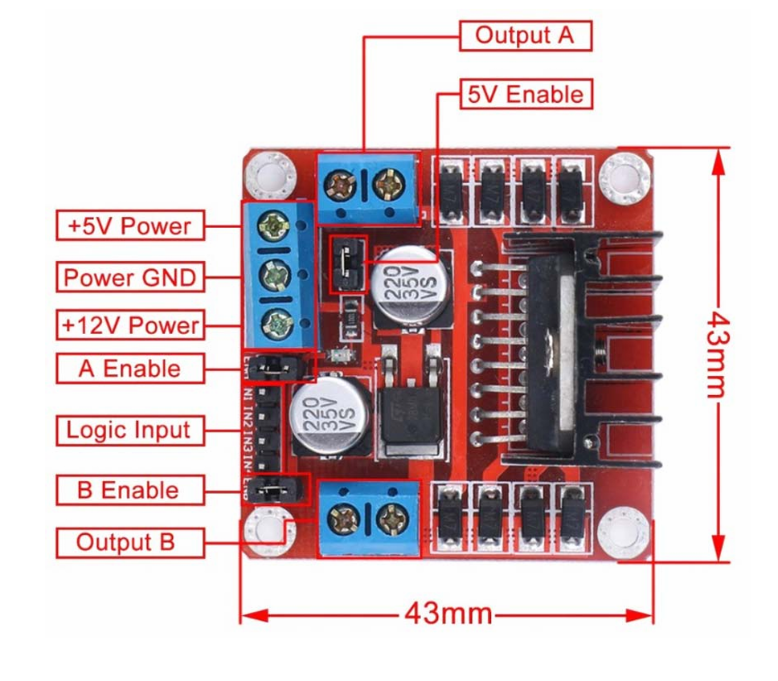
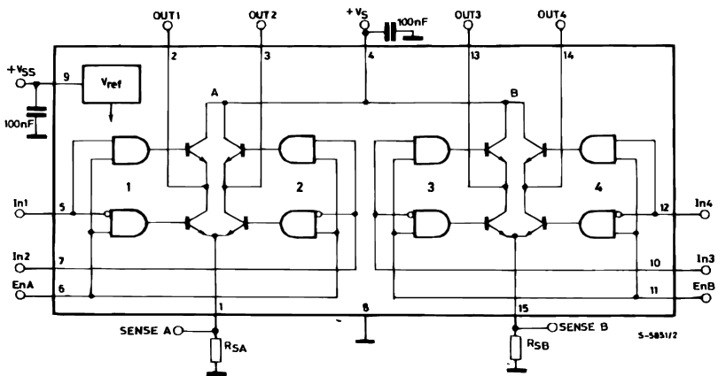
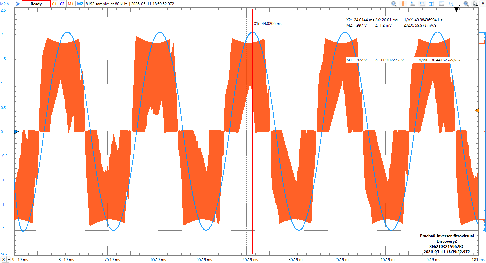
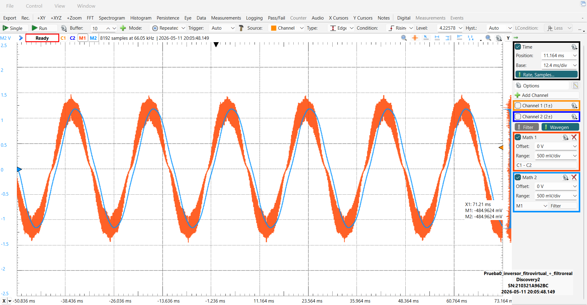

# Prueba de inversor SPWM con STM32G474RE y L298N

Autor: Juan Pablo Vargas Cordoba  
Universidad: Universidad Nacional de Colombia  
Proyecto: Prueba de generacion SPWM para control de puente H con modulo L298N

Este documento integra la informacion completa de la prueba de concepto que se
tenia en `C:\Users\juanv\Downloads\README (3).md`, organizada dentro del
repositorio del proyecto.

## Indice

- Resumen y objetivos.
- Componentes utilizados.
- Conexion de la STM32 y el modulo L298N.
- Alimentacion logica y alimentacion de potencia.
- Fundamento SPWM y calculos.
- Funcion de `ENA`, `IN1` e `IN2`.
- Medicion diferencial `OUT1 - OUT2`.
- Diseno del codigo.
- Graficas de WaveForms.
- Filtro LC fisico, calculos y resultados.
- Conclusiones de la prueba.

## Resumen

En esta etapa se implemento una prueba experimental de un inversor monofasico
controlado mediante SPWM usando una tarjeta `STM32 NUCLEO-G474RE` y un modulo
`L298N`. La STM32 genera tres senales de control:

- Una senal SPWM de alta frecuencia hacia `ENA`.
- Una senal digital hacia `IN1`.
- Una senal digital complementaria hacia `IN2`.

El L298N usa estas senales para conmutar su puente H interno y obtener una
salida alterna diferencial entre `OUT1` y `OUT2`.

La salida se verifico con `Analog Discovery 2` usando WaveForms. Primero se
midio la salida diferencial sin filtro fisico, usando un filtro digital solo
para visualizar mejor la forma de onda. Despues se implemento un filtro LC en
protoboard para reducir la componente de alta frecuencia de la SPWM y observar
una forma de onda mas cercana a una senoidal.

## Objetivos

- Configurar la STM32G474RE para generar una senal SPWM por hardware usando
  `TIM1_CH1`.
- Controlar el puente A del L298N usando `ENA`, `IN1` e `IN2`.
- Comprobar que el L298N invierte la polaridad de la salida mediante el puente H
  interno.
- Medir correctamente la salida diferencial del inversor como `OUT1 - OUT2`.
- Implementar un filtro LC fisico para suavizar la senal SPWM de salida.
- Documentar el montaje, el codigo, las mediciones y el funcionamiento del
  sistema.

## Componentes utilizados

| Componente | Uso en la prueba |
| --- | --- |
| `STM32 NUCLEO-G474RE` | Generacion de SPWM y senales de polaridad. |
| Modulo `L298N` | Puente H de baja potencia. |
| Protoboard y jumpers | Montaje experimental. |
| Fuente DC externa | Alimentacion de potencia del puente H. |
| `Analog Discovery 2` con WaveForms | Medicion de senales y salida diferencial. |
| Resistencia `10 ohm / 10 W` | Carga resistiva. |
| Inductor `270 uH` | Elemento serie del filtro LC. |
| Capacitores electroliticos espalda con espalda | Capacitor equivalente no polarizado. |

## Descripcion general del sistema

```text
STM32 NUCLEO-G474RE  ->  L298N puente H  ->  Filtro LC y carga
```

La STM32 no entrega potencia a la carga. Su funcion es generar las senales de
control. La potencia que recibe la carga proviene de la fuente externa conectada
al L298N.

```text
Fuente DC de potencia
        |
        v
     L298N
 puente H interno
        |
        v
  OUT1 - OUT2
 salida alterna diferencial
```

Las senales de control usadas son:

```text
A5 / PC0 -> ENA -> SPWM
D7 / PA8 -> IN1 -> seleccion de polaridad
D8 / PA9 -> IN2 -> seleccion de polaridad complementaria
```

## Conexiones principales

### Pines usados en la STM32

| Pin fisico Nucleo | Pin MCU | Funcion |
| --- | --- | --- |
| `A5` | `PC0` | Senal SPWM hacia `ENA` del L298N. |
| `D7` | `PA8` | Senal digital hacia `IN1`. |
| `D8` | `PA9` | Senal digital hacia `IN2`. |
| `GND` | GND | Tierra comun del sistema. |
| `5V` | 5 V | Alimentacion logica del modulo L298N durante la prueba. |

### Pines usados en el L298N

| Pin del L298N | Conexion | Funcion |
| --- | --- | --- |
| `A Enable` / `ENA` | `A5 / PC0` | Habilita el puente A mediante SPWM. |
| `IN1` | `D7 / PA8` | Selecciona una polaridad del puente. |
| `IN2` | `D8 / PA9` | Selecciona la polaridad contraria. |
| `OUT1` | Carga/filtro | Salida del puente A. |
| `OUT2` | Carga/filtro | Salida complementaria del puente A. |
| `+5V Power` | `5V` de la STM32 | Alimentacion logica del modulo. |
| `Power GND` | GND comun | Referencia comun. |
| `+12V Power` | Fuente externa | Entrada de potencia del puente H. |

La imagen siguiente muestra la distribucion de pines del modulo L298N utilizado.
En el proyecto se empleo solamente el puente A: `A Enable`, `IN1`, `IN2`,
`OUT1` y `OUT2`.



Para que la STM32 pueda controlar `ENA`, se retiro el jumper de `A Enable`. Si
ese jumper queda instalado, el modulo mantiene `ENA` fijo en alto y la STM32 no
puede aplicar la SPWM sobre el pin de habilitacion.

## Alimentacion del L298N

El L298N requiere dos alimentaciones conceptualmente diferentes.

### Alimentacion logica VSS

Alimenta la electronica interna de control del L298N. En el modulo aparece como
`+5V Power`. En esta prueba se alimento desde el pin `5V` de la Nucleo.

Esta alimentacion no mueve la carga; solo permite que el integrado interprete
las senales `ENA`, `IN1` e `IN2`.

### Alimentacion de potencia VS

Es la alimentacion que el puente H conmuta hacia la carga. En el modulo aparece
como `+12V Power`. Aunque el borne se llame `+12V`, durante la prueba se uso una
fuente de `5 V` para reducir corriente y calentamiento.

Durante el montaje hubo dos tensiones de `5 V` con funciones distintas:

```text
5 V de la STM32  -> alimentacion logica del L298N
5 V de la fuente -> alimentacion de potencia del puente H
```

Todas las partes del sistema deben compartir la misma referencia:

```text
GND STM32 ---- GND protoboard ---- Power GND L298N ---- GND Analog Discovery
```

## Fundamento de la SPWM

La SPWM, modulacion sinusoidal por ancho de pulso, consiste en generar pulsos de
amplitud fija pero con ancho variable. La altura instantanea del pulso la define
la alimentacion de potencia del puente H; lo que cambia es el tiempo durante el
cual ese pulso permanece encendido.

Para una frecuencia PWM de `20 kHz`, el periodo de cada pulso es:

```text
T_PWM = 1 / 20000
T_PWM = 50 us
```

Si el duty cycle es `80 %`, la salida permanece activa durante:

```text
t_on = 50 us * 0.80
t_on = 40 us
```

y apagada durante:

```text
t_off = 50 us * 0.20
t_off = 10 us
```

Si la alimentacion de potencia ideal es `5 V`, el promedio ideal durante ese
periodo PWM es:

```text
V_promedio = Vdc * duty
V_promedio = 5 V * 0.80
V_promedio = 4 V
```

Esto no significa que el pulso tenga una altura de `4 V`. El pulso sigue
intentando llegar a la tension de la fuente de potencia. Lo que equivale a `4 V`
es el valor promedio durante el periodo PWM.

En el puente H, el signo del promedio depende de la polaridad seleccionada por
`IN1` e `IN2`:

```text
Vout_promedio = polaridad * Vdc * duty
```

donde:

```text
polaridad = +1 cuando IN1 = 1 e IN2 = 0
polaridad = -1 cuando IN1 = 0 e IN2 = 1
```

Por lo tanto, la SPWM no genera directamente una senoidal pura. Genera pulsos
rapidos cuyo valor promedio sigue una forma senoidal. El filtro LC se encarga de
atenuar la componente de alta frecuencia y dejar visible la componente de baja
frecuencia.

## Funcion de cada senal

Para entender el control del puente H es necesario separar dos funciones:

- `IN1` e `IN2` definen el sentido de la corriente por la carga.
- `ENA` define durante cuanto tiempo se deja pasar energia en ese sentido.

```text
IN1 e IN2 -> eligen la polaridad de la salida
ENA       -> habilita o deshabilita esa polaridad con SPWM
```

### Senal A5 / PC0 hacia ENA

`A5` corresponde al pin `PC0` de la STM32. En CubeMX fue configurado como
`TIM1_CH1`, por lo que puede generar PWM por hardware.

Esta senal entra al pin `ENA` del L298N:

```text
ENA = 1 -> el puente A puede conducir
ENA = 0 -> el puente A queda deshabilitado
```

En esta prueba `ENA` recibe la senal SPWM. Cuando `ENA` esta en alto, la fuente
DC se aplica a la carga con la polaridad definida por `IN1` e `IN2`. Cuando
`ENA` esta en bajo, el puente deja de entregar energia.

### Senal D7 / PA8 hacia IN1

`D7` corresponde al pin `PA8` de la STM32. Esta senal entra a `IN1` del L298N.
No es la SPWM; es una senal de direccion. En el codigo, `IN1` cambia cada
`10 ms`:

```text
Primeros 10 ms   -> IN1 = 1
Siguientes 10 ms -> IN1 = 0
```

Como un periodo completo dura `20 ms`, la frecuencia fundamental de salida es:

```text
f = 1 / 20 ms
f = 50 Hz
```

### Senal D8 / PA9 hacia IN2

`D8` corresponde al pin `PA9` de la STM32. Esta senal entra a `IN2` del L298N.
`IN2` es complementaria a `IN1`:

```text
Si IN1 = 1, entonces IN2 = 0
Si IN1 = 0, entonces IN2 = 1
```

Esta complementariedad permite que el puente H entregue primero una polaridad y
luego la polaridad opuesta.

### Operacion conjunta

Durante el primer semiciclo:

```text
IN1 = 1
IN2 = 0
ENA = SPWM
```

Durante el segundo semiciclo:

```text
IN1 = 0
IN2 = 1
ENA = SPWM
```

| Intervalo | IN1 / D7 | IN2 / D8 | ENA / A5 | Efecto sobre `OUT1 - OUT2` |
| --- | --- | --- | --- | --- |
| Primeros `10 ms` | Alto | Bajo | SPWM | Pulsos de una polaridad. |
| Siguientes `10 ms` | Bajo | Alto | SPWM | Pulsos de polaridad contraria. |

## Funcionamiento del puente H en el L298N

El L298N contiene dos puentes H internos. En esta prueba se utilizo el puente A,
formado por `IN1`, `IN2`, `ENA`, `OUT1` y `OUT2`.



En un puente H, la carga se conecta entre dos nodos de salida. La inversion de
polaridad se logra activando pares diagonales de transistores.

Para una polaridad:

```text
+Vdc -> transistor superior izquierdo -> OUT1 -> carga -> OUT2
     -> transistor inferior derecho -> GND
```

Para la polaridad contraria:

```text
+Vdc -> transistor superior derecho -> OUT2 -> carga -> OUT1
     -> transistor inferior izquierdo -> GND
```

La STM32 no controla directamente cada transistor interno. La STM32 entrega las
ordenes logicas:

```text
IN1/IN2 -> seleccionan el par diagonal
ENA     -> habilita ese par con pulsos SPWM
```

## Salida diferencial OUT1 - OUT2

La salida util del puente H no se mide como `OUT1` contra GND ni como `OUT2`
contra GND. La carga esta conectada entre `OUT1` y `OUT2`, por lo que la tension
real sobre la carga es:

```text
Vout = OUT1 - OUT2
```

Si se mide cada salida por separado respecto a GND, ambas senales se mueven
entre `0 V` y la tension de la fuente de potencia. Por eso no se observa una
senal negativa clara en cada canal individual.

Ejemplo:

```text
OUT1 = +5 V
OUT2 = 0 V
Vout = OUT1 - OUT2 = +5 V
```

Luego el puente invierte:

```text
OUT1 = 0 V
OUT2 = +5 V
Vout = OUT1 - OUT2 = -5 V
```

Por esta razon, en WaveForms se uso:

```text
CH1 -> OUT1
CH2 -> OUT2
Math 1 = C1 - C2
```

`Math 1` representa la tension que realmente recibe la carga.

## Diseno del codigo

El codigo propio del proyecto se encuentra principalmente en:

- `PRUEBA0_SPWM_L298N/Core/Src/main.c`
- `PRUEBA0_SPWM_L298N/Core/Src/l298n_spwm.c`
- `PRUEBA0_SPWM_L298N/Core/Inc/l298n_spwm.h`

Los demas archivos corresponden principalmente a inicializacion generada por
STM32CubeMX: reloj, GPIO, TIM1, BSP de la Nucleo y archivos HAL/CMSIS.

### Archivo main.c

En `main.c` se inicializan los perifericos:

```c
MX_GPIO_Init();
MX_TIM1_Init();
```

Luego se inicializa y arranca el modulo de control SPWM:

```c
L298N_SPWM_Init();
L298N_SPWM_SetModulation(L298N_MODULACION_SPWM);
L298N_SPWM_Start();
```

La modulacion se definio como:

```c
#define L298N_MODULACION_SPWM       800U
```

Esto equivale a una modulacion del `80 %`.

Dentro del ciclo infinito se ejecuta:

```c
L298N_SPWM_Task();
```

Esta funcion actualiza el duty de la SPWM y cambia la polaridad cada `10 ms`.

### Archivo l298n_spwm.c

Este archivo contiene la logica de generacion SPWM.

Parametros principales:

```c
#define L298N_PWM_TIMER              htim1
#define L298N_PWM_CHANNEL            TIM_CHANNEL_1
#define L298N_SPWM_TABLE_SIZE        100U
#define L298N_SPWM_UPDATE_US         200U
#define L298N_OUTPUT_PERIOD_US       20000U
#define L298N_HALF_PERIOD_US         10000U
#define L298N_DEFAULT_MODULATION     800U
```

Interpretacion:

- `TIM1_CH1` genera el PWM en `PC0/A5`.
- La tabla SPWM contiene `100` muestras.
- Cada muestra dura `200 us`.
- `100 * 200 us = 20000 us = 20 ms`.
- Un periodo de `20 ms` equivale a `50 Hz`.
- Cada `10 ms` se invierte la polaridad del puente.

La tabla `spwm_abs_sine_table` contiene valores entre `0` y `1000`. Se usa una
tabla senoidal absoluta porque el PWM no maneja valores negativos. El signo de
la salida lo determinan `IN1` e `IN2`.

La funcion `SetBridgePolarity()` establece la polaridad:

```c
1U -> IN1 alto, IN2 bajo
0U -> IN1 bajo, IN2 alto
```

La funcion `SetDutyPermille()` actualiza el registro de comparacion del timer:

```c
__HAL_TIM_SET_COMPARE(...)
```

La tarea `L298N_SPWM_Task()` realiza el proceso repetitivo:

1. Lee el tiempo actual.
2. Calcula la posicion dentro del periodo de `20 ms`.
3. Selecciona la muestra correspondiente de la tabla.
4. Invierte `IN1/IN2` si se llega al siguiente semiciclo.
5. Aplica el nuevo duty al PWM de `ENA`.

## Medicion con Analog Discovery 2

La medicion se realizo conectando:

```text
AD2 GND -> GND comun
CH1 1+  -> OUT1
CH2 2+  -> OUT2
```

En WaveForms se creo:

```text
Math 1 = C1 - C2
```

Despues se agrego un filtro digital:

```text
Math 2 = filtro low-pass de Math 1
```

El filtro digital solo se utilizo para visualizar mejor la componente de baja
frecuencia. No modifica el circuito fisico.

## Graficas de WaveForms

### Salida diferencial con filtro digital, sin filtro LC real

La siguiente captura muestra la salida diferencial `OUT1 - OUT2` con ayuda de
un filtro digital en WaveForms, antes de montar el filtro LC fisico.



### Salida con filtro LC fisico y filtro digital

La siguiente captura muestra la salida despues de implementar el filtro LC en la
protoboard. La senal medida presenta menor contenido de conmutacion, y la
version filtrada digitalmente permite observar mejor la componente senoidal.



## Filtro LC fisico implementado

El filtro LC se conecto en la salida diferencial del puente H:

```text
OUT1 ---- L 270 uH ---- nodo filtrado ---- carga 10 ohm ---- OUT2
                              |
                              C equivalente
                              |
                            OUT2
```

El inductor se conecto en serie desde `OUT1`. La resistencia de carga y el
capacitor equivalente se conectaron entre el nodo filtrado y `OUT2`.

La configuracion final de prueba fue:

```text
L = 270 uH
Carga = 10 ohm / 10 W
C = 47 uF + 47 uF en serie espalda con espalda
Ceq aproximado = 23.5 uF
Fuente de potencia = 5 V
```

Como los capacitores disponibles eran electroliticos polarizados, se usaron dos
capacitores iguales en serie espalda con espalda para obtener un capacitor
equivalente no polarizado:

```text
nodo filtrado ---- +| |- ---- -| |+ ---- OUT2
```

Para dos capacitores iguales en serie:

```text
Ceq = C / 2
```

Por lo tanto, para dos capacitores de `47 uF`:

```text
Ceq = 47 uF / 2
Ceq = 23.5 uF
```

La frecuencia de corte aproximada del filtro LC es:

```text
fc = 1 / (2*pi*sqrt(L*C))
```

Con:

```text
L = 270 uH
C = 23.5 uF
```

se obtiene aproximadamente:

```text
fc ~= 2.0 kHz
```

Esta frecuencia permite conservar la componente de `50 Hz` y atenuar parte de la
portadora PWM de aproximadamente `20 kHz`.

## Resultados

Con la configuracion implementada se verifico que:

- La STM32 genera la senal SPWM en `PC0/A5`.
- `PA8/D7` y `PA9/D8` cambian de estado de forma complementaria cada `10 ms`.
- El L298N invierte la polaridad entre `OUT1` y `OUT2`.
- La salida util debe medirse como `OUT1 - OUT2`.
- Sin filtro LC, la salida se observa como una senal bipolar compuesta por
  pulsos SPWM.
- Con el filtro LC, la salida presenta una forma mas suave y cercana a una
  senoidal.

## Conclusiones

La prueba permitio comprobar experimentalmente el principio de operacion de un
inversor controlado por SPWM. El pin `ENA` del L298N recibe una senal PWM de
ancho variable, mientras que `IN1` e `IN2` determinan la polaridad de la salida.
De esta forma, el puente H entrega pulsos positivos durante un semiciclo y
pulsos negativos durante el semiciclo contrario.

La medicion diferencial `OUT1 - OUT2` fue esencial para observar la salida real
aplicada a la carga. Ademas, la implementacion del filtro LC permitio reducir la
componente de alta frecuencia asociada a la conmutacion y visualizar una forma
de onda mas senoidal.

El montaje con L298N es adecuado como demostracion didactica del control SPWM y
del funcionamiento de un puente H. Para una etapa de potencia definitiva es
necesario utilizar un driver y dispositivos de conmutacion disenados para mayor
eficiencia y capacidad de corriente.
