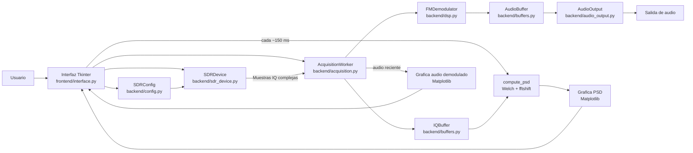

# Documentacion del software SDR

# Intrgrantes de Grupo:
Juan Pablo Vargas - Sebastián Tovar

Este proyecto implementa una aplicacion de escritorio en Python para recibir
señales con un RTL-SDR, visualizar la densidad espectral de potencia (PSD),
demodular FM en tiempo real y reproducir el audio resultante.

## 1. Visión general del sistema

El sistema recibe muestras IQ complejas del RTL-SDR, calcula una PSD de la
señal, demodula FM y reproduce audio.

Diagrama general:



## 2. Estructura del proyecto

```text
lab_sdr/
├── lab_sdr.py                 # Entrada principal alternativa
├── scripts/
│   └── run_app.py             # Entrada principal real de la aplicacion
├── frontend/
│   └── interface.py           # GUI Tkinter, graficas y control de ejecucion
└── backend/
    ├── acquisition.py         # Hilo de adquisicion SDR + procesamiento por bloques
    ├── audio_output.py        # Salida de audio con sounddevice
    ├── buffers.py             # Buffers de IQ y audio seguros para hilos
    ├── config.py              # Parametros y validacion de configuracion
    ├── dsp.py                 # Calculo de PSD y demodulacion FM
    └── sdr_device.py          # Wrapper del dispositivo RTL-SDR
```

## 3. Descripción de cada archivo

### `lab_sdr.py`

Punto de entrada sencillo que ejecuta `scripts/run_app.py`.

### `scripts/run_app.py`

Agrega la raíz del proyecto a `sys.path` y arranca la aplicación con
`frontend.interface.run_app()`.

### `frontend/interface.py`

Construye la interfaz gráfica con Tkinter y Matplotlib.

- Panel de parámetros y controles.
- Panel de gráfica PSD.
- Panel de gráfica de audio demodulado.
- Lógica de inicio/parada, verificación del SDR y prueba de audio.
- Actualización periódica de las gráficas y el estado.

### `backend/config.py`

Define la configuración de operación (`SDRConfig`) y valida los rangos.

Parámetros importantes:

- `fc_mhz`: frecuencia central en MHz.
- `span_mhz`: ancho de banda / sample rate del SDR.
- `nperseg`: tamaño de segmento para Welch.
- `noverlap`: solapamiento en Welch.
- `gain_db`: ganancia del RTL-SDR.
- `freq_correction_ppm`: corrección de frecuencia del oscilador.
- `fine_tune_khz`: ajuste fino en kHz.
- `channel_rate_hz`: tasa intermedia para el canal FM.
- `channel_filter_cutoff_hz`: ancho del filtro de canal FM.
- `audio_rate_hz`: frecuencia de muestreo de audio.
- `psd_buffer_samples`: máximo de muestras para PSD.
- `psd_alpha`: factor de suavizado de PSD.
- `audio_volume`: nivel de salida.
- `deemphasis_us`: tiempo de deemphasis FM.
- `audio_buffer_duration_s`: duración máxima del buffer de audio.
- `audio_prebuffer_duration_s`: audio necesario antes de iniciar reproducción.
- `audio_output_block_duration_s`: tamaño de bloque del stream.
- `audio_output_latency_s`: latencia de la salida.

### `backend/sdr_device.py`

Administra el dispositivo RTL-SDR con `pyrtlsdr`.

Funciones clave:

- `open(config)`: abre el SDR.
- `configure(config)`: aplica sample rate, frecuencia, corrección y ganancia.
- `read_samples(sample_count)`: lee muestras IQ y elimina el offset DC.
- `read_samples_async(callback, sample_count)`: lectura asincrónica.
- `cancel_async_read()`: detiene la lectura asincrónica.
- `close()`: cierra el dispositivo.

### `backend/acquisition.py`

Gestiona la adquisición continua de datos en hilos.

- Un hilo solicita muestras asincrónicamente al SDR.
- Otro hilo procesa los bloques recibidos.
- El buffer de entrada se maneja con cola y condición.
- Si la cola se llena, se descartan bloques antiguos.
- Cada bloque se guarda en `IQBuffer` y se procesa con el demodulador FM.

### `backend/buffers.py`

Define buffers seguros para hilos.

- `IQBuffer`: almacena muestras IQ para cálculo de PSD.
- `AudioBuffer`: almacena audio demodulado para reproducción.

Ambos colocan y leen datos con `Lock` para evitar condiciones de carrera.

### `backend/dsp.py`

Contiene el procesamiento de señal:

- `compute_psd()`: obtiene PSD mediante Welch y `fftshift`.
- `FMDemodulator`: demodulación FM completa.

### `backend/audio_output.py`

Controla la reproducción de audio con `sounddevice`.

- Usa PulseAudio en WSL.
- Reproduce audio mono `float32`.
- Cuenta callbacks y estados de la salida.
- Tiene prueba de tono de 440 Hz.

## 4. Funcionamiento completo del sistema

### Arranque y flujo principal

1. El usuario abre la aplicación.
2. La UI crea los objetos de backend y los controles.
3. Al pulsar **Iniciar**:
   - Se leen los datos de `FC`, `Span`, `NFFT / Nperseg` y `noverlap`.
   - Se valida `SDRConfig`.
   - Se abre y configura el RTL-SDR.
   - Se inicia `AcquisitionWorker`.
4. El SDR comienza a entregar bloques de muestras IQ.
5. Cada bloque se almacena en `IQBuffer`.
6. Cada bloque se envía a `FMDemodulator.demodulate()`.
7. El audio resultante se guarda en `AudioBuffer`.
8. Cuando hay suficiente audio en el buffer, se inicia la reproducción.
9. La UI actualiza periódicamente la PSD y la forma de onda de audio.

### Demodulación FM

El proceso de demodulación es:

- La señal recibida es compleja (IQ).
- Se reduce la tasa de muestreo a `channel_rate_hz`.
- Se calcula la diferencia de fase entre muestras sucesivas:
  `angle(x[n] * conj(x[n-1]))`.
- Esa diferencia representa la variación de frecuencia FM.
- Se elimina la componente DC.
- Se remuestrea el resultado a la tasa de audio.
- Se filtra en banda de 40 Hz a 16 kHz.
- Se aplica `deemphasis` FM.
- Se ajusta el nivel con AGC y volumen.
- Se devuelve audio mono en `float32`.

### Cálculo de PSD

La PSD se calcula con:

- `scipy.signal.welch()` sobre las muestras IQ.
- ventana Hann.
- `nperseg` y `noverlap` configurables.
- `return_onesided=False` para espectro complejo.
- `fftshift()` para centrar frecuencias.
- conversión a dB/Hz.
- suavizado exponencial con `psd_alpha`.

El eje horizontal se muestra en MHz, centrado en la frecuencia seleccionada.

### Filtrado

Hay dos filtros principales:

1. Filtro de canal FM:
   - Lowpass de 6 ordenes antes de decimar a `channel_rate_hz`.
   - Protege contra aliasing.
2. Filtro de audio:
   - Bandpass de 40 Hz a 16 kHz en la tasa de audio.
   - Elimina ruido fuera de la banda audible.

Además, se aplica:

- Deemphasis FM de 50/75 us.
- AGC para nivelar la amplitud del audio.

### Reproducción de audio

- El audio se acumula en `AudioBuffer`.
- El stream de `sounddevice` pide bloques de audio.
- Si no hay suficiente audio, se produce un `underrun`.
- Si hay exceso, se descarta audio antiguo para reducir latencia.
- `Probar audio` reproduce un tono fijo de 440 Hz.

## 5. Explicación del dashboard / interfaz

### Recinto de parámetros

Este recuadro controla la recepción y la PSD:

- `FC [MHz]`: frecuencia central que sintoniza el SDR.
- `Span [MHz]`: ancho de banda de muestreo del SDR.
- `NFFT / Nperseg`: resolución para la PSD.
- `noverlap`: cuanto se traslapan los fragmentos de Welch.

### Gráfica PSD

Muestra la energía de señal por frecuencia alrededor de la `FC`.

- Picos grandes indican emisoras o señales.
- La escala en dB/Hz muestra la potencia espectral.
- La visualización se actualiza en tiempo real.

### Gráfica de audio demodulado

Muestra la forma de onda de audio audible después de la demodulación.

- Permite ver si el audio está activo.
- Sirve para detectar saturación, ruido o poca señal.

### Botones y su significado

- `Iniciar`: comienza la recepción y reproducción.
- `Detener`: detiene la adquisición y el audio.
- `Aplicar`: actualiza parámetros y reconfigura el SDR.
- `Salir`: cierra la aplicación.
- `Verificar SDR`: lee un bloque de prueba del RTL-SDR.
- `Probar audio`: reproduce un tono de prueba de 440 Hz.

### Indicador de estado

El texto inferior informa sobre:

- si el sistema está adquiriendo.
- FC y Span actuales.
- longitud del buffer de audio.
- underruns y muestras descartadas.

## 6. Parámetros que se pueden modificar desde el dashboard

Los parámetros modificables directamente en la UI son:

- `FC [MHz]`
- `Span [MHz]`
- `NFFT / Nperseg`
- `noverlap`

Estos afectan directamente:

- la frecuencia de sintonización.
- el ancho de observación.
- la resolución de la PSD.
- la suavidad y actualización de la PSD.

Parámetros internos que existen en el código y afectan la operación son:

- `gain_db` (ganancia del SDR).
- `freq_correction_ppm` (corrección de frecuencia).
- `fine_tune_khz` (ajuste fino).
- `channel_rate_hz` (tasa de canal FM).
- `channel_filter_cutoff_hz` (filtro de canal).
- `audio_rate_hz` (tasa de audio).
- `audio_volume` (volumen final).
- `deemphasis_us` (deemphasis FM).
- `audio_buffer_duration_s` y `audio_prebuffer_duration_s`.

## 7. Video de funcionamiento

En la carpeta del proyecto `VIDEOS_IMAGENES` está el video:

- `VIDEOS_IMAGENES/FUNCIONAMIENTO_DASHBOARD.mp4`

Este video muestra el funcionamiento completo del dashboard:

- configuración de parámetros.
- inicio de adquisición.
- visualización de PSD.
- reproducción de audio.
- uso de los botones de verificación y prueba.

## 8. Ejecución

Para iniciar la aplicación desde la raíz del proyecto:

```bash
python lab_sdr.py
```

O también:

```bash
python scripts/run_app.py
```

> Nota: Para que el audio funcione en WSL se usa `PULSE_SERVER=
> unix:/mnt/wslg/PulseServer`.

- La demodulacion implementada es FM por diferencia de fase; no hay seleccion
  explicita de desplazamiento de canal dentro del span.

## Limitaciones actuales

- La UI solo expone frecuencia central, span, NFFT y solapamiento.
- La ganancia, volumen, deemphasis, limites de PSD y tasas internas se configuran
  en codigo.
- No hay selector de modo de demodulacion distinto a FM.
- No hay waterfall/espectrograma; solo PSD instantanea suavizada.
- No hay grabacion de IQ o audio.
- No hay archivo `requirements.txt` en el directorio.

