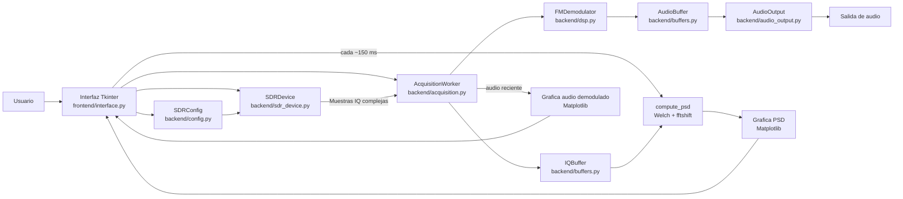

# Documentacion del software SDR

Este proyecto implementa una aplicacion de escritorio en Python para visualizar la
densidad espectral de potencia (PSD) de una senal recibida con RTL-SDR y escuchar
audio FM demodulado a partir de las muestras IQ.

## Diagrama general



## Objetivo

La aplicacion sirve para:

- Sintonizar una frecuencia central en MHz.
- Ajustar el ancho de observacion o `span`.
- Visualizar la PSD alrededor de la frecuencia central.
- Demodular FM en tiempo real desde las muestras IQ recibidas.
- Reproducir el audio demodulado.
- Verificar la lectura del dispositivo RTL-SDR y probar la salida de audio.

## Estructura del proyecto

```text
lab_sdr/
├── lab_sdr.py                 # Entrada principal alternativa
├── scripts/
│   └── run_app.py             # Entrada principal real de la aplicacion
├── frontend/
│   └── interface.py           # GUI Tkinter, graficas y control de ejecucion
└── backend/
    ├── acquisition.py         # Hilo de adquisicion SDR + procesamiento por bloques
    ├── audio_output.py        # Salida de audio con sounddevice
    ├── buffers.py             # Buffers de IQ y audio seguros para hilos
    ├── config.py              # Parametros y validacion de configuracion
    ├── dsp.py                 # Calculo de PSD y demodulacion FM
    └── sdr_device.py          # Wrapper del dispositivo RTL-SDR
```

## Flujo de ejecucion

1. `scripts/run_app.py` agrega la raiz del proyecto al `sys.path` y llama
   `frontend.interface.run_app()`.
2. `SDRApp` crea la ventana principal, los controles, las graficas y los objetos
   de backend.
3. Al presionar **Iniciar**, la interfaz:
   - Lee los parametros de la UI.
   - Valida la configuracion.
   - Abre y configura el RTL-SDR.
   - Crea un `AcquisitionWorker` en un hilo de fondo.
4. El hilo de adquisicion lee bloques IQ desde `SDRDevice.read_samples()`.
5. Cada bloque IQ se guarda en `IQBuffer` para la grafica PSD.
6. El mismo bloque IQ pasa por `FMDemodulator.demodulate()` para obtener audio.
7. El audio demodulado se guarda en `AudioBuffer`, se envia a la grafica de audio
   y se reproduce mediante `AudioOutput`.
8. La UI se actualiza periodicamente con `root.after()`:
   - PSD aproximadamente cada 150 ms.
   - Forma de onda de audio aproximadamente cada 40 ms.

## Modulos principales

### `backend/config.py`

Define `SDRConfig`, una dataclass con los parametros de operacion:

- `fc_mhz`: frecuencia central en MHz.
- `span_mhz`: tasa de muestreo del SDR y ancho visualizado.
- `nperseg`: tamano de segmento usado por Welch para la PSD.
- `noverlap`: solapamiento entre segmentos Welch.
- `gain_db`: ganancia del RTL-SDR.
- `channel_rate_hz`: tasa intermedia para el canal FM.
- `audio_rate_hz`: tasa final de audio.
- `psd_buffer_samples`: muestras maximas usadas para calcular PSD.
- `psd_alpha`: factor de suavizado exponencial de PSD.
- `audio_volume`: ganancia final de audio.
- `deemphasis_us`: constante de deemphasis FM.

Tambien valida rangos importantes, por ejemplo frecuencia central, span,
`nperseg`, `noverlap`, tamanos de buffer y relacion entre tasa de canal y tasa
de muestreo.

### `backend/sdr_device.py`

Encapsula el uso de `rtlsdr.RtlSdr`:

- `open(config)`: abre el dispositivo y aplica la configuracion.
- `configure(config)`: ajusta sample rate, frecuencia central y ganancia.
- `read_samples(sample_count)`: lee IQ y elimina el promedio DC del bloque.
- `close()`: cierra el dispositivo.

### `backend/acquisition.py`

`AcquisitionWorker` ejecuta la lectura continua en un hilo de fondo. En cada
iteracion:

1. Lee muestras IQ del SDR.
2. Inserta IQ en `IQBuffer`.
3. Demodula FM.
4. Inserta audio en `AudioBuffer`.
5. Notifica a la interfaz el audio mas reciente.

Si ocurre una excepcion, llama el callback `on_error` para que la UI cierre la
adquisicion de forma controlada.

### `backend/buffers.py`

Contiene dos buffers con proteccion por `threading.Lock`:

- `IQBuffer`: guarda chunks de muestras IQ y descarta las mas antiguas al superar
  el limite de muestras.
- `AudioBuffer`: cola de audio para reproduccion. Si se llena, descarta audio
  antiguo para mantener latencia baja.

### `backend/dsp.py`

Contiene dos funciones centrales de procesamiento:

#### PSD

`compute_psd(samples, config, previous_psd=None)`:

1. Calcula PSD con `scipy.signal.welch`.
2. Usa ventana Hann.
3. Trabaja con espectro bilateral (`return_onesided=False`), adecuado para IQ
   complejo.
4. Aplica `fftshift` para centrar la frecuencia cero.
5. Convierte el eje de frecuencia a MHz RF:

```text
frecuencia_rf_mhz = (frecuencia_central_hz + frecuencia_baseband_hz) / 1e6
```

6. Convierte potencia a dB/Hz.
7. Aplica suavizado exponencial:

```text
psd_suavizada = alpha * psd_actual + (1 - alpha) * psd_anterior
```

#### Demodulacion FM

`FMDemodulator.demodulate(iq_samples, config)`:

1. Canaliza o remuestrea IQ hacia `channel_rate_hz`.
2. Calcula la diferencia de fase entre muestras consecutivas:

```text
fase[n] = angle(x[n] * conj(x[n-1]))
```

3. Elimina componente DC de la diferencia de fase.
4. Remuestrea hacia `audio_rate_hz`.
5. Elimina DC de audio.
6. Aplica filtro pasa banda de audio de 40 Hz a 16 kHz.
7. Aplica deemphasis FM.
8. Aplica AGC sencillo y control de volumen.
9. Limita la salida entre -1 y 1 y entrega `float32`.

### `backend/audio_output.py`

Usa `sounddevice.OutputStream` para reproducir audio mono a baja latencia. El
callback del stream consume muestras desde `AudioBuffer`. Tambien incluye
`play_test_tone()`, que reproduce un tono de 440 Hz para verificar el audio.

### `frontend/interface.py`

Implementa la interfaz grafica con Tkinter y Matplotlib:

- Panel izquierdo de parametros.
- Botones: iniciar, detener, aplicar, salir, verificar SDR y probar audio.
- Grafica superior: PSD en dB/Hz contra frecuencia MHz.
- Grafica inferior: audio demodulado contra tiempo en ms.
- Temporizador de actualizacion con `root.after()`.
- Manejo de errores mediante `messagebox`.

## Parametros visibles en la interfaz

| Parametro | Significado | Valor inicial |
| --- | --- | --- |
| `FC [MHz]` | Frecuencia central del RTL-SDR | `100.0` |
| `Span [MHz]` | Sample rate del SDR y ancho mostrado | `2.88` |
| `NFFT / Nperseg` | Resolucion de Welch | `4096` |
| `noverlap` | Solapamiento de Welch | `2048` |

Otros parametros quedan definidos en `SDRConfig`, pero no aparecen todavia como
controles de la UI.

## Dependencias

El codigo importa estas librerias:

- `numpy`
- `scipy`
- `matplotlib`
- `sounddevice`
- `pyrtlsdr` / modulo `rtlsdr`
- `tkinter`

Tambien requiere:

- Dispositivo RTL-SDR compatible.
- Libreria del sistema `librtlsdr`.
- Salida de audio disponible. En WSL se configura por defecto:

```text
PULSE_SERVER=unix:/mnt/wslg/PulseServer
```

## Como ejecutar

Desde la raiz del proyecto:

```bash
python lab_sdr.py
```

O directamente:

```bash
python scripts/run_app.py
```

Si se usa el entorno virtual incluido:

```bash
source venv/bin/activate
python lab_sdr.py
```

## Consideraciones de operacion

- El span tambien actua como sample rate del RTL-SDR.
- La PSD usa muestras acumuladas en `IQBuffer`, no solo el ultimo bloque.
- El audio se prebufferiza antes de iniciar la reproduccion para reducir cortes.
- Si `sample_rate_hz` no es multiplo de `channel_rate_hz`, se usa
  `resample_poly` en lugar de decimacion entera.
- Si `channel_rate_hz` no es multiplo de `audio_rate_hz`, tambien se usa
  `resample_poly` para audio.
- La demodulacion implementada es FM por diferencia de fase; no hay seleccion
  explicita de desplazamiento de canal dentro del span.

## Limitaciones actuales

- La UI solo expone frecuencia central, span, NFFT y solapamiento.
- La ganancia, volumen, deemphasis, limites de PSD y tasas internas se configuran
  en codigo.
- No hay selector de modo de demodulacion distinto a FM.
- No hay waterfall/espectrograma; solo PSD instantanea suavizada.
- No hay grabacion de IQ o audio.
- No hay archivo `requirements.txt` en el directorio.

## Puntos recomendados para ampliar

- Agregar controles para ganancia, volumen y deemphasis.
- Agregar un cursor o selector de canal para demodular una frecuencia desplazada
  dentro del span.
- Agregar waterfall para observar ocupacion espectral en el tiempo.
- Crear `requirements.txt` para reproducibilidad.
- Permitir grabar audio demodulado en WAV.
- Guardar configuraciones frecuentes.
